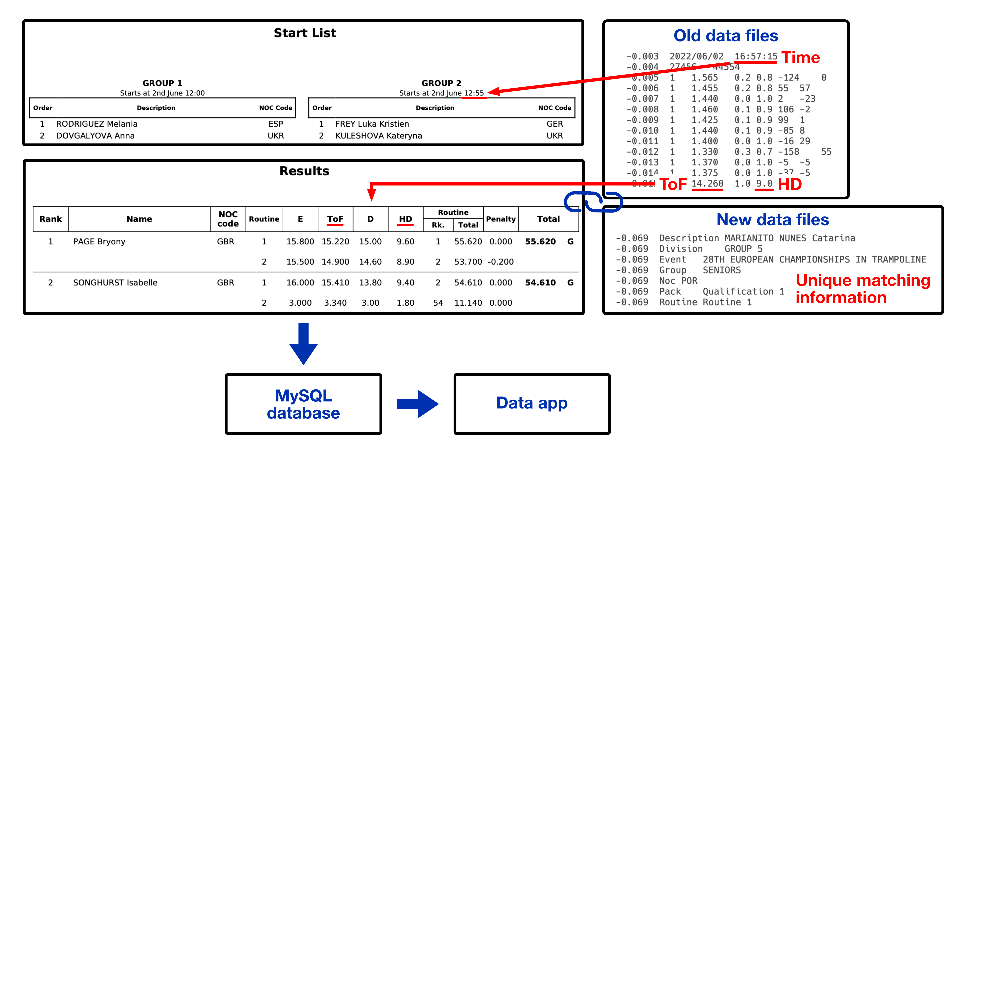

# Trampoline data app
[Click here to get to data app ](http://portfolio.falko.in)
## Overiew
Trampoline scoring is divided into 4 areas: **Difficulty** (of the jumps), **Execution**, **Time of Flight** and **Horizontal Displacement (HD)** on the trampoline. HD reflects the trampoline contact position (more deduction for off center positions). HD was recently introduced and is a score between 7 and 10 points as long as an athlete does 10 valid jumps within an exercise. Influence of HD is questionable since most HD ratings are very similar. New HD approaches were proposed by [Ferger et al. (2020)](https://www.google.com/url?sa=t&rct=j&q=&esrc=s&source=web&cd=&cad=rja&uact=8&ved=2ahUKEwig1cH9vNH6AhUMQ_EDHVMFA0QQFnoECAcQAQ&url=https%3A%2F%2Fwww.researchgate.net%2Fpublication%2F343417147_ESTIMATING_HORIZONTAL_DISPLACEMENT_DEDUCTION_IN_TRAMPOLINE_GYMNASTICS_BY_MEANS_OF_CONSTANT_AND_VARIABLE_ERRORS_OF_LANDING_POSITIONS_A_NEW_GOLD_STANDARD&usg=AOvVaw0RweZ0hwnE3C1qCi6r74j_) that introduce highter deduction and a different focus for deduction. This data app makes it possible to explore changes following the different rating approaches.

## Goals
  
- Create a database of relevant trampoline data consisting of rank, scores and individual jumping data
- Make data explorable
- Include alternative rating approaches
- Highlight influence of rating approaches

## Procedure (see figure below)

- Scrape data from event result books to get scores for relevant events (difficulty, execution, time of flight, horizontal displacement)
- Match existing exercise data (time of flight per jump, x, y coordinates of athletes contact position) for each exercise 
- Create MySQL database with scores and exercise data

## Technical aspects
- Data conversion from PDF to text with Post Script
- Data conversion from text to structured data with Python and Pandas
- MySQL database at Google Cloud
- Streamlit data app connected to MySQL database via GitHub repository

## Problem solving
- PDF rule books from different associations with different formatting hence different algorithms
- Old exercise data without athlete information. Matching through start time, time of flight and horizontal displacement
- New exercise data with unique athlete information easy to match

